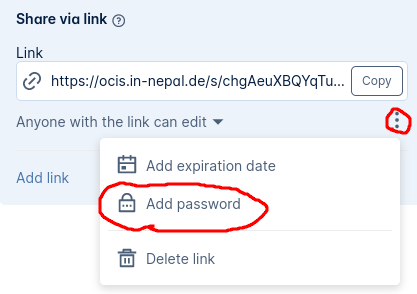
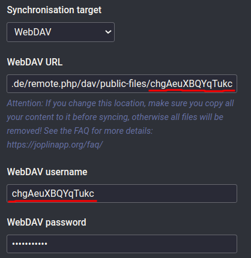

I love to use [Joplin](joplinapp.org) to organize my notes. To syncronize the notes between different devices I have used so far the WebDAV sync option together with [ownCloud 10](github.com/owncloud/core/). Now [oCIS (ownCloud infinite scale)](https://owncloud.com/infinite-scale/) is the new cool kid in the cloud storage space and I would like to use it for syncing of Joplin.

oCIS offers WebDAV, same as ownCloud 10, but has [basic-auth disabled by default and the docs discourage using basic-auth in production](https://doc.owncloud.com/ocis/next/deployment/services/s-list/auth-basic.html#introduction). Instead oCIS implements and OIDC workflow for authentication. I tried to get the OIDC authentication into Joplin, but sadly my [PR](https://github.com/laurent22/joplin/pull/7400) for that was refused.

The workaround is the "Share via link" function f oCIS. The generated links support basic-auth by default. (Don't fear your notes will be still very private).
1. create a folder in oCIS (I've called it `joplin`)
2. click on the "Add people" button of that folder, that will bring you to the sharing functions
3. you should see the "Share via link" function
4. create a new link
5. change the permissions to "Anyone with the link can edit"
6. additionally set a password 
7. to configure Joplin, open its synchronisation settings and:
   1. select "WebDAV" as "Synchronisation target"
   2. copy the whole link URL into "WebDAV URL"
   3. take the last bit of the link URL (everything after tha last `/`) as "WebDAV username"
      
   4. add your password into the "WebDAV password" field

DONE!

To access your notes, one would need to know the random link AND your self selected password - so it should be pretty safe.
You could even have a different link, with a different password for every device you are using.
