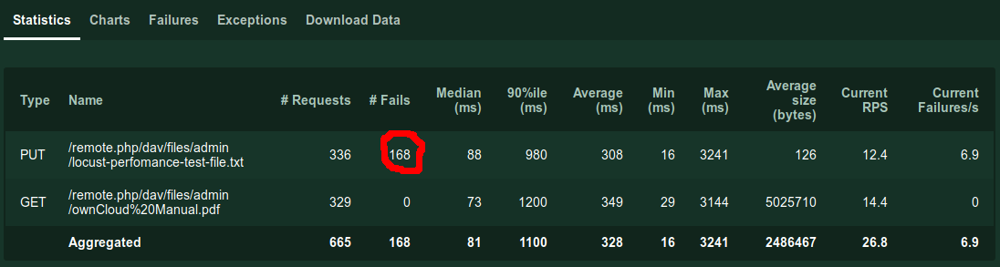
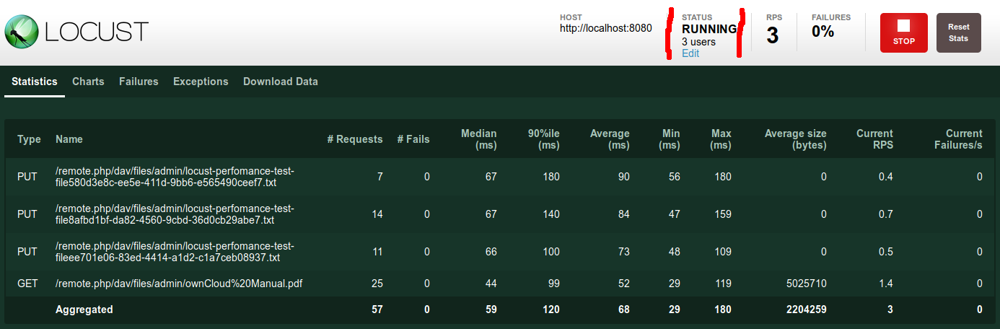

# Preparations

In [the first part of this series](https://dev.to/jankaritech/performance-testing-with-locust-01-get-started-pkk) we talked about creating a very basic locust performance test. Now we want to create some more realistic and interesting tests. For that we better have a real App to test. We could test any App that has an HTTP API. For simplicity and because I'm familiar with it I've chosen [ownCloud](https://owncloud.org/), a file hosting and sharing solution similar to Dropbox.

The easiest way to get a test ownCloud instance up and running is to use docker. Just run: `docker run -p 8080:8080 --name owncloud owncloud/server`. That magic command should give you a fresh ownCloud installation reachable under http://localhost:8080. There is one user pre-setup called `admin` with the super-secure password `admin`. You can login into the UI and upload files, create new users, share files and folders, etc.
OK, after having played a bit with ownCloud itself, let's get back to the performance tests, we actually want to learn about locust.

You should now be able to run the locust test from the first part via `locust --host=http://localhost:8080`, but as we said there, that is not a very realistic test. What would a user do with ownCloud? A main action would be download and upload files. Let's tests the performance of that.

# Test downloading a file

For file-operations ownCloud uses the [WebDAV](https://en.wikipedia.org/wiki/WebDAV) API. Starting from the locustfile we already have, we create a test for a file download.

```
from locust import HttpLocust, TaskSet, task, constant

class UserBehaviour(TaskSet):
    userName = "admin"

    @task
    def downloadFile(self):
        self.client.get(
            "/remote.php/dav/files/" + self.userName + "/ownCloud%20Manual.pdf",
            auth=(self.userName, self.userName)
        )

class User(HttpLocust):
    task_set = UserBehaviour
    wait_time = constant(1)
  ```

Here we are simply running a `GET` on an existing file `ownCloud Manual.pdf` with the `admin` ownCloud-user.
Nice, and not much different from the first attempt.

Remember: when you change the locustfile, you have to stop and start locust to make sure the file is read again.

# Test uploading a file

Every TestSet can have multiple tasks, so adding an upload task should be easy:

```
from locust import HttpLocust, TaskSet, task, constant

class UserBehaviour(TaskSet):
    userName = "admin"
    davEndpoint = "/remote.php/dav/files/" + userName

    @task
    def downloadFile(self):
        self.client.get(
            self.davEndpoint + "/ownCloud%20Manual.pdf",
            auth=(self.userName, self.userName)
        )

    @task
    def uploadFile(self):
        self.client.put(
            self.davEndpoint + "/locust-perfomance-test-file.txt",
            "my data",
            auth=(self.userName, self.userName)
        )

class User(HttpLocust):
    task_set = UserBehaviour
    wait_time = constant(1)
```

Here we have a second task `uploadFile`, it's simply does a `PUT` request with a specific file-name and some data.
(To be more [DRY](https://en.wikipedia.org/wiki/Don%27t_repeat_yourself), I've placed `davEndpoint` in a variable)

Locust will now run every task the same amount of times. But if you run that with enough locust-users (e.g. try 100) you will see the numbers in the `# Fails` column increase



To see what happens, lets look into the "Failures Tab"
There we see the Failure "Type" `HTTPError('423 Client Error: Locked for url: http://localhost:8080/remote.php/dav/files/admin/locust-perfomance-test-file.txt',)`

We have been using one single ownCloud-user `admin` and 100 locust-users. During the write operation ownCloud locks a file, but every second `wait_time = constant(1)` a locust-user tries to over-write that single file. So there will be collisions and that is what the error says.

What about not overwriting the same file again and again, but uploading a new one every time?

```
from locust import HttpLocust, TaskSet, task, constant
import uuid

class UserBehaviour(TaskSet):
    userName = "admin"
    davEndpoint = "/remote.php/dav/files/" + userName
    fileName = ''

    @task
    def downloadFile(self):
        self.client.get(
            self.davEndpoint + "/ownCloud%20Manual.pdf",
            auth=(self.userName, self.userName)
        )

    @task
    def uploadFile(self):
        if self.fileName == '':
            self.fileName = "/locust-perfomance-test-file" + str(uuid.uuid4()) + ".txt"
        self.client.put(
            self.davEndpoint + self.fileName,
            "my data",
            auth=(self.userName, self.userName)
        )

class User(HttpLocust):
    task_set = UserBehaviour
    wait_time = constant(1)
```

Here we just set the fileName to a random string, but only if it has not been set before.

In the locust UI you should now see one `PUT` request per locust-user and hopefully no failures.


# Weight of a task

Now we run every task equally often. But do users upload files as often as they download them?
Maybe, but maybe not - it depends on your situation and on what you want to test. Luckily locust gives your the freedom to choose.
e.g. if you want to simulate the situation that the downloads/read operation occurs 3 times more often that a upload/write operation just add a weight argument to the task

```
...

@task(3)
def downloadFile(self):
    self.client.get(
        self.davEndpoint + "/ownCloud%20Manual.pdf",
        auth=(self.userName, self.userName)
    )

@task(1)
def uploadFile(self):
    if self.fileName == '':
        self.fileName = "/locust-perfomance-test-file" + str(uuid.uuid4()) + ".txt"
    self.client.put(
        self.davEndpoint + self.fileName,
        "my data",
        auth=(self.userName, self.userName)
    )
...
```

Now most of your requests should be `GET`s.

Remember: when testing we try to be as close to reality as possible. [If your test is significantly different to reality, bad things might happen.](https://people.cs.clemson.edu/~steve/Spiro/arianesiam.htm)

# whats next?

We are still only using a single ownCloud user. The application might perform differently when using multiple users. We should create specific test-users before we run the test and ideally delete them at the end of the test run.
